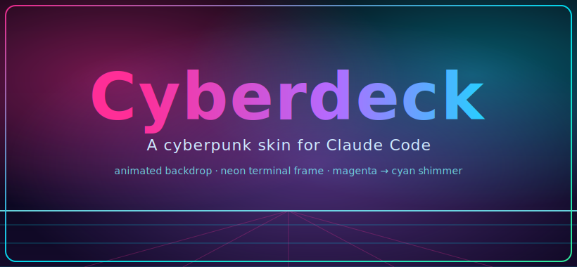

<h1 align="center">Cyberdeck ⚡</h1>

<p align="center">
  A cyberpunk skin for <b>Claude Code</b> running inside VS Code.<br>
  Animated neon backdrop · flowing terminal frame · magenta → cyan shimmer · razor-sharp text.
</p>

<p align="center">
  
</p>

<p align="center">
  <b><a href="https://lilwan345.github.io/claude-code-cyberpunk/wallpaper/">▶ See the live animated scene</a></b>
  &nbsp;·&nbsp; drop a <code>assets/demo.gif</code> here to replace the poster above
</p>

<p align="center">
  <a href="LICENSE"></a>
  
  
</p>

---

## What this is

A coding environment that looks like a synthwave cyberdeck. Three independent
layers — use one, two, or all three:

1. **Animated backdrop** — a real 60 fps `<canvas>` scene (drifting nebula,
   flowing neon waves, a perspective grid floor) that lives *behind* a
   transparent editor and terminal. This is the part that makes people say *woah*.
2. **Color layer** — a near-black, high-neon palette for the whole VS Code UI
   plus the integrated terminal, with the chrome (tabs, scrollbars, the terminal
   frame) restyled in cyberpunk neon.
3. **Claude Code terminal theme** — a matching theme for Claude Code itself, so
   its "thinking" text flows magenta → cyan and its prompts glow neon.

Text stays **crisp** — there is deliberately no glow on the glyphs (it just
makes small text fuzzy). The atmosphere comes from the backdrop and the palette.

## See it before installing anything

The backdrop is adapted from a standalone WebGL/canvas scene I built first as
the reference (it has the full version — synthwave sun + city skyline):

- **Live preview:** https://lilwan345.github.io/claude-code-cyberpunk/wallpaper/
- Or open [`wallpaper/index.html`](wallpaper/index.html) locally in any browser.
- Bonus: set that page as a live macOS desktop wallpaper with
  [Plash](https://github.com/sindresorhus/Plash) (free).

## Heads up (read this first)

This is an enthusiast hack, and it's honest about it:

- **macOS + VS Code** only (the installer patches the VS Code app bundle).
- The backdrop works by injecting CSS/JS into VS Code's `workbench.html`.
  VS Code will show a one-time **"Your installation appears corrupt"** banner —
  that's expected; dismiss it.
- **A VS Code update wipes the backdrop** (it replaces `workbench.html`). Just
  re-run `./install.sh` after updating. The color layer and Claude theme survive
  updates — they live in your user settings, untouched.

## Install

```bash
git clone https://github.com/lilwan345/claude-code-cyberpunk.git
cd claude-code-cyberpunk
```

**1 · Color layer** — open VS Code settings JSON
(`Cmd+Shift+P` → *Preferences: Open User Settings (JSON)*) and merge in the keys
from [`settings/settings-snippet.jsonc`](settings/settings-snippet.jsonc).
The transparent `#00000000` backgrounds are what let the backdrop show through.

**2 · Claude Code theme**

```bash
mkdir -p ~/.claude/themes
cp theme/cyberpunk-neon.json ~/.claude/themes/
```

Then in Claude Code: `/theme` → **Cyberpunk Neon**.

**3 · Animated backdrop**

```bash
./install.sh
```

**4 · Reload** — `Cmd+Shift+P` → *Developer: Reload Window*.

> If `install.sh` says it can't write to the app bundle:
> `sudo chown -R "$(whoami)" "/Applications/Visual Studio Code.app"`, then re-run.

## After a VS Code update

```bash
cd claude-code-cyberpunk && ./install.sh
```

…then reload the window. That's the only upkeep.

## Make it yours

All the knobs are at the top of the source files — edit, then re-run `./install.sh`:

| Want to change | File | Knob |
|---|---|---|
| Brightness / how dark the text veil is | `custom-css/cyberpunk-bg.js` | `DIM` (lower = brighter) |
| Animation speed | `custom-css/cyberpunk-bg.js` | `SPEED`, `GRIDSPEED` |
| Nebula color & intensity | `custom-css/cyberpunk-bg.js` | `nebula[].a`, `.c` |
| Wave size | `custom-css/cyberpunk-bg.js` | wave `amp` |
| Terminal frame / scrollbars / tabs | `custom-css/cyberpunk-bg.css` | — |

## How it works

`install.sh` inlines three files into VS Code's `workbench.html`, between
`VSCODE-CUSTOM-CSS` markers:

- `cyberpunk-bg.js` prepends a full-window `<canvas>` (z-index 0) and animates it.
- `cyberpunk-bg.css` makes the workbench, editor, and terminal backgrounds
  transparent so the canvas shows through, then restyles the chrome.
- `cyberpunk-glow.css` adds the glassmorphism + status-bar layer.

No VS Code extension required — it's a self-contained patch. Every run backs up
`workbench.html` first (`*.bak-cyberdeck-*`).

## Credits

Built in the open. Inspired by the synthwave/outrun aesthetic and the long
lineage of neon VS Code themes (SynthWave '84 and friends) — this one pushes it
from a static glow to a live animated backdrop, tuned to sit behind Claude Code.

## License

[MIT](LICENSE) © 2026 Liyuan Wan. Use it, fork it, remix it.
